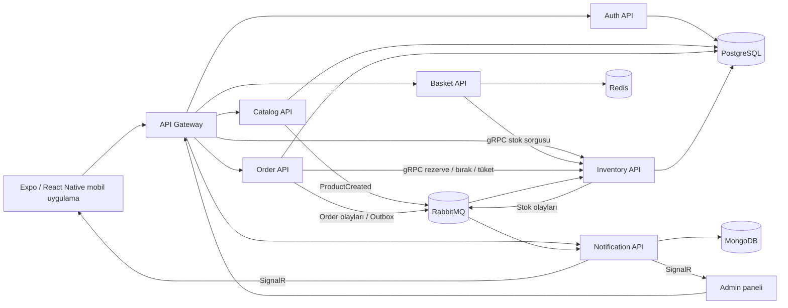

# Melo's Pizza Microservices

Melo's Pizza; gerçek bir pizza sipariş akışını mikroservisler, olay tabanlı iletişim ve canlı bildirimler üzerinden modelleyen full-stack bir öğrenme projesidir. Sistem; mobil müşteri uygulaması, yönetim paneli, API Gateway ve bağımsız veri depolarına sahip yedi backend servisinden oluşur.

> Projenin amacı yalnızca çalışan bir demo çıkarmak değil; CQRS, Vertical Slice Architecture, DDD, Outbox Pattern, RabbitMQ, gRPC, Redis, SignalR ve servis başına veri sahipliği gibi yaklaşımları birlikte ve anlaşılır bir senaryo üzerinde uygulamaktır.

## Öne çıkan özellikler

- JWT tabanlı kayıt, giriş ve rol bazlı yetkilendirme
- Kategori, ürün, seçenek, malzeme ve görsel yönetimi
- Redis üzerinde kullanıcıya özel sepet
- PostgreSQL üzerinde sipariş ve adres yönetimi
- Pizza hamuru havuzları ile doğrudan adet stoklarının birlikte takibi
- Basket ve Order servislerinden Inventory servisine tip güvenli gRPC iletişimi
- RabbitMQ ve MassTransit ile servisler arası asenkron olaylar
- Order servisinde Outbox Pattern ile güvenilir olay yayımlama
- MongoDB üzerinde kalıcı bildirim geçmişi
- Notification servisi üzerinden SignalR ile canlı sipariş ve kritik stok bildirimleri
- Mobil müşteri uygulaması ve sipariş/stok yönetimi için web tabanlı admin paneli

## Sistem mimarisi



Mobil ve admin istemcileri servis adreslerini bilmez; HTTP isteklerini Gateway üzerinden gönderir. Servisler senkron ve hızlı cevap gereken stok işlemlerinde gRPC, birbirinden bağımsız ilerleyebilen iş akışlarında RabbitMQ kullanır.

## Servisler

| Servis | Sorumluluk | Veri kaynağı |
| --- | --- | --- |
| Gateway | İstekleri doğru mikroservise yönlendirme ve response forwarding | Yapılandırılmış servis haritası |
| Auth | Kullanıcı, adres, JWT ve rol yönetimi | PostgreSQL `auth_db` |
| Catalog | Kategori, ürün, seçenek, malzeme ve ürün görselleri | PostgreSQL `catalog_db` |
| Basket | Kullanıcı sepeti ve stok uygunluk kontrolü | Redis |
| Order | Sipariş aggregate'i, durum geçişleri ve Outbox mesajları | PostgreSQL `order_db` |
| Inventory | Hamur havuzları, doğrudan ürün stokları, rezervasyon ve kritik eşik | PostgreSQL `inventory_db` |
| Notification | Event consumer'ları, bildirim geçmişi ve SignalR yayını | MongoDB `notification_db` |

## Temel iş akışları

### Sipariş oluşturma

1. Kullanıcı giriş yaptığında Auth API bir JWT üretir.
2. Mobil uygulamanın Axios interceptor'ı token'ı sonraki isteklere `Authorization: Bearer ...` olarak ekler.
3. Ürün sepete eklenirken Basket API, Inventory API'den gRPC ile stok uygunluğunu sorgular.
4. Kullanıcı adres, ödeme yöntemi ve not seçerek Order API'ye siparişi gönderir.
5. Order API gerekli stoğu gRPC ile rezerve eder ve siparişi PostgreSQL'e kaydeder.
6. Domain event aynı transaction içinde Outbox tablosuna yazılır.
7. Outbox dispatcher olayı RabbitMQ'ya yayımlar.
8. Notification API olayı tüketir, MongoDB'ye kaydeder ve SignalR ile admin paneline ve ilgili kullanıcıya iletir.

### Sipariş durumu

Sipariş durumları kontrollü bir akışla ilerler:

`Pending -> Confirmed -> Preparing -> Shipped -> Delivered`

Admin paneli siparişi onaylayabilir, hazırlamaya alabilir, kuryeye teslim edebilir ve teslim edildi olarak tamamlayabilir. Her durum değişikliği RabbitMQ üzerinden Notification servisine ulaşır ve açık SignalR bağlantılarına anlık olarak yayınlanır.

Sipariş iptal edilirse rezerve stok Inventory servisine geri bırakılır. Kullanıcının ekranında iptal durumu canlı olarak görünür.

### Stok modeli

Inventory iki farklı stok türünü birlikte yönetir:

- `Dough`: Pizzalar ürün bazında değil, seçilen boyuta ait ortak hamur havuzundan düşer (`dough-small`, `dough-medium`, `dough-large`, `dough-xl`).
- `Direct`: İçecek, tatlı ve sos gibi hazır ürünler kendi ürün kimliği üzerinden doğrudan adetle izlenir.

Sipariş oluşturulunca stok önce rezerve edilir. Sipariş teslim edilince rezervasyon tüketilir; iptal edilince yeniden kullanılabilir stoğa döner. Kullanılabilir miktar kritik eşiğe indiğinde `LowStockDetected` olayı üretilir ve admin paneline bildirim gönderilir.

## Kullanılan teknolojiler

- .NET 10 ve ASP.NET Core Minimal APIs
- Entity Framework Core ve PostgreSQL
- MediatR ile CQRS ve Vertical Slice Architecture
- FluentValidation ve ortak validation pipeline behavior
- Result Pattern ve global exception handler
- MassTransit ve RabbitMQ
- Protocol Buffers ve gRPC
- Redis
- MongoDB
- SignalR
- React Native, Expo ve TypeScript
- Axios ve TanStack Query
- Docker Compose

## Proje yapısı

```text
.
|-- src/
|   |-- BuildingBlocks/            Ortak result, behavior, persistence, security ve web parçaları
|   |-- Contracts/
|   |   `-- Inventory.Contracts/   Integration event ve gRPC sözleşmeleri
|   `-- Services/
|       |-- Auth/
|       |-- Basket/
|       |-- Catalog/
|       |-- Gateway/
|       |-- Inventory/
|       |-- Notification/
|       `-- Order/
|-- mobile/opsflow-mobile/         Expo / React Native müşteri uygulaması
|-- admin-panel/                   Sipariş ve stok yönetim paneli
|-- frontend/opsflow-web/          İlk web istemcisi / geliştirme scaffold'u
|-- outputs/postman/               Postman collection, environment ve kullanım notları
|-- scripts/                       Yerel başlatma ve durdurma scriptleri
|-- docker-compose.yml
`-- OpsFlow.slnx
```

Backend servislerinde feature odaklı Vertical Slice düzeni kullanılır. Bir kullanım senaryosunun endpoint, command/query, validator ve handler dosyaları aynı feature altında bulunur. `Program.cs` yalnızca modül kayıtlarını ve middleware sırasını bir araya getirir.

Mobil uygulamada Container/Presenter yaklaşımı uygulanır:

- İş ve ekran state'i `hooks/useFeature.ts` dosyalarında tutulur.
- API çağrıları `services/` altında yapılır.
- Domain tipleri `types/` altında ayrılır.
- Sunum bileşenleri iş mantığı taşımaz.
- Stiller bileşenin yanında `*.styles.ts` dosyasında bulunur.

## Yerel geliştirme

Önerilen geliştirme düzeninde PostgreSQL, RabbitMQ, Redis ve MongoDB Docker'da; .NET servisleri bilgisayarda çalışır. Böylece uygulama kodu değişiklikleri hızlı başlar ve altyapı için yerel kurulum gerekmez.

### Gereksinimler

- .NET 10 SDK
- Docker Desktop
- Node.js ve npm
- Python 3 (statik admin paneli sunucusu için)
- PowerShell 7 veya Windows PowerShell

### Tek komutla başlatma

```powershell
.\scripts\start-local.ps1
```

Script şu işlemleri otomatik yapar:

1. Önceki Melo's Pizza süreçlerini bilinen portlardan kapatır.
2. Docker'daki API container'larını durdurup yalnızca altyapı servislerini başlatır.
3. PostgreSQL, RabbitMQ, Redis ve MongoDB portlarını bekler.
4. Solution'ı Release modunda derler.
5. API'leri doğru bağımlılık sırasıyla yerelde başlatır.
6. Gateway, admin paneli ve Expo web uygulamasını başlatır.
7. Önemli portları ve HTTP endpoint'lerini doğrular.

Sık kullanılan seçenekler:

```powershell
# Mevcut derlemeyi kullanarak daha hızlı başlat
.\scripts\start-local.ps1 -SkipBuild

# Altyapı container'larını da yeniden başlat
.\scripts\start-local.ps1 -RestartInfrastructure

# Expo cache'ini temizle
.\scripts\start-local.ps1 -ClearExpoCache

# Admin panelini veya mobili başlatma
.\scripts\start-local.ps1 -SkipAdmin
.\scripts\start-local.ps1 -SkipMobile

# Yerel uygulamaları durdur, Docker altyapısını açık bırak
.\scripts\stop-local.ps1
```

Çalışma logları `outputs/local-runtime/` altında oluşur ve Git tarafından takip edilmez.

### Yerel adresler

| Bileşen | Adres |
| --- | --- |
| Gateway | `http://localhost:5022` |
| Auth API | `http://localhost:5208` |
| Catalog API | `http://localhost:5174` |
| Basket API | `http://localhost:5150` |
| Order API | `http://localhost:5093` |
| Inventory API | `http://localhost:5141` |
| Notification API | `http://localhost:5044` |
| Notification Hub | `http://localhost:5044/hubs/notifications` |
| Admin paneli | `http://localhost:7070` |
| Expo web | `http://localhost:8081` |
| RabbitMQ yönetim paneli | `http://localhost:15672` |

Gateway üzerinden bir servis çağrısı şu formattadır:

```text
http://localhost:5022/proxy/{service}/{endpoint}
```

Örnek:

```text
GET http://localhost:5022/proxy/catalog/products
POST http://localhost:5022/proxy/auth/auth/login
GET http://localhost:5022/proxy/order/orders/me
```

Yerel geliştirmede yalnızca başlangıç için bir admin hesabı seed edilir. Bu hesap üretim verisi değildir:

```text
E-posta: admin@opsflow.ai
Parola: P@ssw0rd123
```

## Postman ile test

Hazır dosyalar [outputs/postman](outputs/postman/) klasöründedir:

- `opsflow.postman_collection.json`
- `opsflow.postman_environment.json`
- Akış açıklaması için `README.md`

Environment olarak `OpsFlow Local` seçildiğinde istekler Gateway üzerinden çalışır. Collection; kayıt, giriş, kategori/ürün oluşturma, otomatik stok kaydı, sepete ekleme, sipariş oluşturma ve bildirim sorgulama adımlarını içerir.

## Tam Docker modu

Tüm servisleri container olarak çalıştırmak için:

```powershell
docker compose up --build
```

Bu modda Gateway `http://localhost:8000`, servisler ise `8001-8006` aralığındaki portlardan erişilebilir.

> Yerel API'lerle Docker API container'larını aynı anda çalıştırmayın. İki Order, Inventory veya Notification instance'ı aynı RabbitMQ kuyruklarını paylaşırsa mesajlar instance'lar arasında dağıtılır ve test sonucu hangi süreçte işlendiğine göre değişebilir. `start-local.ps1` bu çakışmayı otomatik önler.

Yerel ve Docker çalışma biçimleri aynı veritabanı adlarını kullanır: `auth_db`, `catalog_db`, `inventory_db` ve `order_db`. Yalnızca PostgreSQL host adı değişir (`localhost` veya `postgres`). Böylece `_local` isimli ikinci veritabanları oluşmaz.

## Sık kullanılan endpoint'ler

| Amaç | Method ve endpoint |
| --- | --- |
| Kayıt | `POST /auth/register` |
| Giriş | `POST /auth/login` |
| Adreslerim | `GET /auth/addresses` |
| Ürünler | `GET /products` |
| Sepetim | `GET /baskets/me` |
| Sepete ürün ekleme | `POST /baskets/me/items` |
| Sipariş oluşturma | `POST /orders` |
| Siparişlerim | `GET /orders/me` |
| Sipariş iptali | `POST /orders/{id}/cancel` |
| Admin siparişleri | `GET /orders` |
| Admin durum güncelleme | `PATCH /admin/orders/{orderId}/status` |
| Stoklar | `GET /stock` |
| Stok düzeltme | `POST /stock/{productId}/adjust` |

Yetki gerektiren endpoint'ler kullanıcı kimliğini body veya URL'den değil, JWT içindeki `sub` claim'inden alır. Admin endpoint'leri ayrıca `AdminOnly` policy'sini zorunlu tutar.

## Doğrulama

```powershell
# Backend
dotnet build OpsFlow.slnx --no-restore

# Mobil TypeScript
cd mobile\opsflow-mobile
npx tsc --noEmit
```

## Geliştirme notları

- Docker Compose ve appsettings dosyalarındaki anahtarlar yalnızca yerel geliştirme içindir; production secret olarak kullanılmamalıdır.
- Ödeme yöntemi şu an sipariş verisi olarak saklanır, gerçek bir ödeme sağlayıcısı entegrasyonu yoktur.
- Gateway servis keşfi geliştirme ortamı için yapılandırılmış servis haritasıyla yapılır; production ortamında reverse proxy/service discovery çözümüyle değiştirilebilir.
- Mobil istemci Expo SDK 51 tabanındadır.
- RAG servisi planlanan sonraki aşamadır ve mevcut sipariş akışına dahil değildir.
